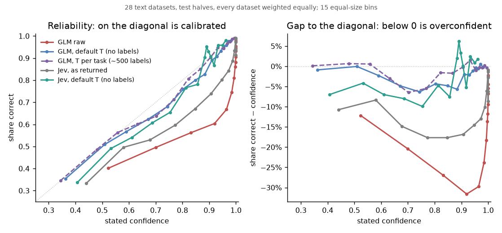
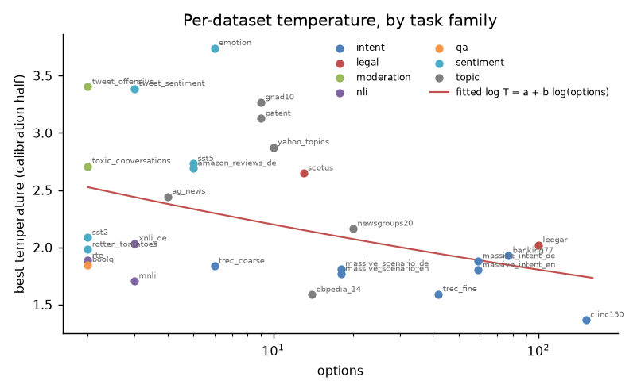
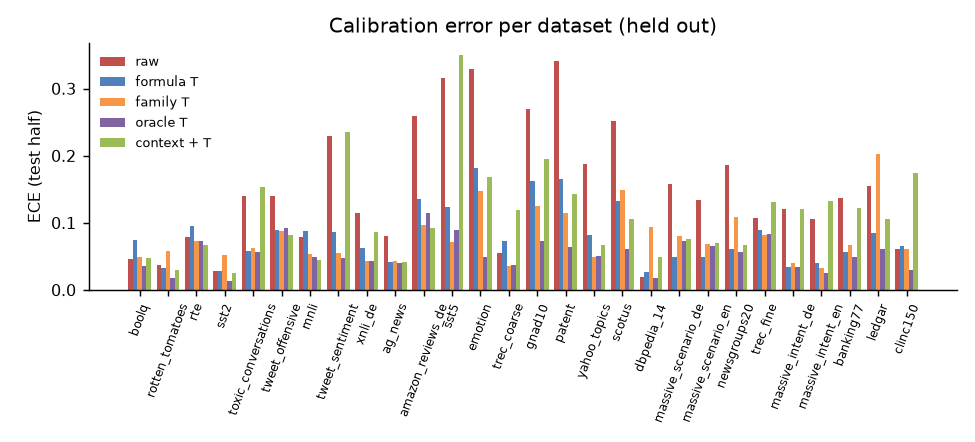
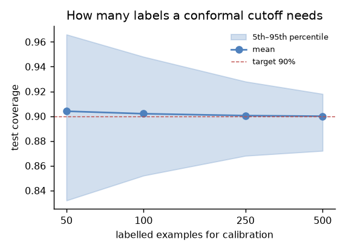

# Can the probabilities be trusted? Calibration of GLM-5.3-Flash

GLM-5.3-Flash on Privatemode, one-token decisions with the `answer=`
prefill (see [the note on the prefill](#decisions-for-the-library)), 29
datasets, up to 1,000 examples each, two identical runs. Every dataset is
split 50/50 into a calibration and a test half (fixed seed); means weight
datasets equally, and rvl_cdip (scanned documents) is kept apart from the
28 text datasets. The full tables are in [full-report.md](full-report.md).

**How ECE is reported.** ECE uses 15 equal-size bins of top-answer
confidence. On a test half of a few hundred examples, sampling alone gives
even a perfectly calibrated model some ECE, about 0.05 here: the **floor**.
Three forms appear: the *pooled* ECE bins all test examples of all datasets
together, which averages that noise away (raw 0.146); the *mean
per-dataset* ECE includes each dataset's floor (raw about 0.15, 0.081 after
the default temperature); and *excess* ECE subtracts the floor (0.129 raw,
0.032 after the default). Compare numbers only with their own kind.

## Results

**1. Raw probabilities are overconfident, on every dataset.** Mean
confidence exceeds accuracy by 14.6 points, and the pooled expected
calibration error (ECE) is 0.146. Hard tasks are the worst: emotion is 93%
confident at 60% accuracy.

**2. One temperature per task fixes it.** Dividing the log probabilities by
the best T for a task brings ECE down to the sampling floor, the error a
perfectly calibrated model would show on that many examples. The best T
ranges from 1.4 to 3.7 (median 2.0); it is stable between runs (a factor of
1.006) and depends mostly on the kind of task.



The right panel plots the distance from the diagonal: below 0 is
overconfident. The "default T" is the option-count formula in result 3,
fitted without the dataset being scored. "T per task" is fitted on that
task's own calibration half. The [overview](../README.md#results) has every
method, and Jev, in one table on the same examples. The table is also at the
end of section 3 of [full-report.md](full-report.md).

**3. Without labels, a formula gets most of the way.** On datasets left out
of the fit, with *excess ECE*: a dataset's ECE minus the ECE a perfectly
calibrated model shows on the same number of examples, so 0 is as good as
the sample can show.

| zero-label temperature | mean excess ECE | share of the per-task gain |
|---|---|---|
| none (raw) | 0.129 | 0% |
| one global T (2.15) | 0.040 | 63% |
| from the number of options, `log T = 0.96 − 0.076·log(options)` | 0.032 | 71% |
| from the task family, e.g. sentiment 2.9, intent 1.8 | 0.029 | 74% |
| per task, fitted on labels (reference) | 0.006 | 100% |

The formula holds under stricter separation between fitting and testing:

| the option formula, fitted without … | mean excess ECE | share of the per-task gain |
|---|---|---|
| the dataset in question (as above) | 0.032 | 71% |
| its related datasets too (the four MASSIVE sets, both TREC, MNLI and XNLI, the SST family, both TweetEval) | 0.032 | 71% |
| half of all tasks, tested on the other half (50 random splits) | 0.035 | 68% (60–76%) |
| its whole task family | 0.054 | 45% |

Siblings in the fit don't flatter the result, and fitting on half the tasks
gives the same answer with more spread. **A new kind of task is the
realistic worst case:** with no dataset of the same family in the fit, the
default recovers 45% of the per-task gain. The method itself (the formula's
form, the shrinkage, the prefill) was chosen on these datasets; only
datasets kept out of the whole study can measure that, which part 3 plans.

What sets the right T is mostly how hard the task is: across datasets, log T
falls by 1.4 per unit of accuracy. The model is about equally confident
everywhere, so it is most overconfident where it is least accurate. No
label-free statistic of its own outputs (mean confidence, entropy) predicted
T better than a constant. The library applies the option formula by default
and takes a task family on request.



**4. Contextual calibration hurts.** Dividing out what the model picks for
neutral input (`N/A`, empty, `[MASK]`) made 24 of 28 datasets worse and cost
up to 16 points of accuracy; it helped on one (sst2, barely) and was
neutral on three. The "bias" is real knowledge: with no content, *neutral*
or *other* is the right answer. Any partial strength was worse than none.
Its one real use is option names that carry a bias of their own: boolq with
`true`/`false` renamed to `correct`/`wrong` lost 5.6 points, and
contextual calibration recovered 1.9 of them.



**5. Conformal sets deliver their guarantee, with a few hundred labels.**
Split conformal prediction on each task's calibration half:

| target | coverage reached | mean options per set | single-option answers |
|---|---|---|---|
| 90% | 90.8% | 1.8 | 64% |
| 95% | 95.5% | 3.1 | 46% |

Single-option answers are the share that can be automated at that level. A
zero-label cutoff pooled from other datasets hit 90% on average but fell
more than 2 points short on 9 of 28 datasets (worst 72%), so it's a
heuristic, not a guarantee. Temperature barely changes set sizes (1.84 →
1.78 options at 90%): it improves the stated confidence, not which options
are plausible.



With 100 labels, 90% of calibrations land between 85% and 95% coverage;
with 500, between 87% and 92%, and part of that spread is the test half's
own sampling noise. Labels must be a random sample: labels from escalated
cases only are skewed toward hard ones and break the guarantee.

## Checks

- **Label noise, an upper bound and a check.** Where three of four other
  systems in the published runs agree against the label (8% of banking77,
  25% of emotion), removing those examples removes most of the remaining
  overconfidence (emotion +18 → 0 points). That overstates it: the removed
  examples include ones where GLM is confidently wrong along with the others.
  Reading all 80 flagged banking77 examples found 31% clear label errors,
  50% where both answers are defensible, and 19% where the label is right
  ([banking77-label-check.json](banking77-label-check.json); read by Claude,
  not yet by a person, so these shares are provisional; `bench.label_page`
  builds the page for a person's check). Relabelling only the clear errors takes banking77's
  overconfidence from +3.8 to +1.4 points, where removing every flag gives
  −1.5. Wrong labels explain part of the gap, not all of it.
- **Contamination: no effect once difficulty is known.** Datasets whose
  presence in training is unclear need a higher T (2.7 against 2.1 for sets
  certainly seen), but they are also harder. With accuracy in the model, the
  tier adds nothing (+0.09 ± 0.12 in log T). What predicts softening is
  difficulty, so harder customer tasks will need more of it.
- **German** needs about the same T as English (2.3 against 2.2).
- **Scanned documents** (rvl_cdip) are overconfident too (ECE 0.25); the
  formula T is not fitted on them.
- **Off-option signal.** With `answer=` the model puts about 99% of its
  probability on the option numbers, right or wrong. As an error signal,
  low mass is weak and points the wrong way: pooled AUROC 0.44 [0.43, 0.45]
  (0.5 is chance), significantly below 0.5 on 18 of 28 datasets, so right
  answers carry slightly *less* mass. Confidence scores 0.74. Mass flagged
  deliberately mismatched options in only one of four pairings; confidence
  did better in all four. The library reports it as `option_mass` and no
  more.

## Decisions for the library

- **The prefill is now `answer=`.** The first blog post shows
  `choice_index:`, and the library later used `answer:`. After either, the
  model wants a space first, and chat templates strip a trailing one, so
  under 0.1% of its probability was on the options and the read was
  conditioned on an unlikely token. With `answer=` about 99% is. Accuracy is
  unchanged (+0.1 points against `answer:`), and so is calibration after the
  default temperature.
- Temperature is applied by default for GLM Flash, from the option count, or
  from a task family with `SystemOne(..., temperature="sentiment")`;
  `temperature=1` gives raw probabilities. Other models stay raw until
  measured. The playground shows the calibrated values.
- `calibrate(answers, labels, coverage=0.9)` fits a per-task T and a
  conformal cutoff; `Calibration.predict_set(answer)` returns the set,
  never empty.
- No automatic contextual calibration.

## Reproduce

```sh
pip install -e '.[privatemode,calibration]'
python -m bench.suite -n 1000 --replicates 1 --arms privatemode --concurrency 4 --out runs/r1
python -m bench.suite -n 1000 --replicates 1 --arms privatemode --concurrency 4 --out runs/r2
python -m bench.neutral_priors --out neutral-priors.json
python -m bench.off_option --out off-option.json
python -m bench.calibrate_report --run runs/r1 --second runs/r2 \
    --priors neutral-priors.json --published <published runs>/results \
    --label-check banking77-label-check.json --out report/
```

Run a suite command twice on the same `--out` to fill rows lost to the
proxy's rate limit. [Part 2](../part-2/README.md) compares Jev on the same
examples, adds a guaranteed error rate for automated answers, and tests
position bias. The raw runs used here are in the release
[`calibration-2026-09-26`](https://github.com/edgelesssys/privatemode-decisions-benchmark/releases/tag/calibration-2026-09-26), with every run of parts 1–3, including the Kimi K2.6 and GLM-5.3 runs.
