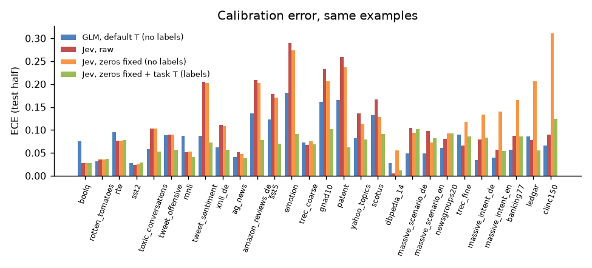
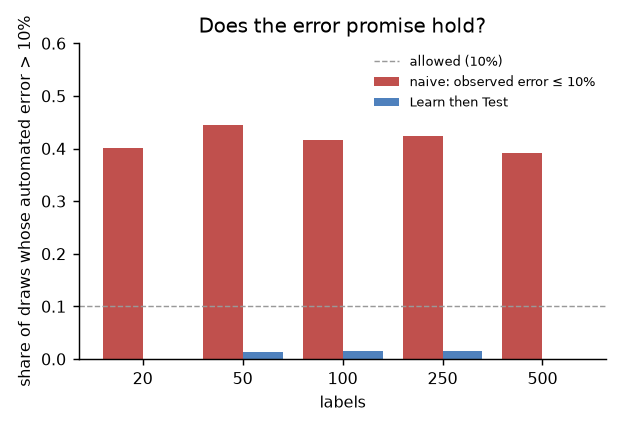
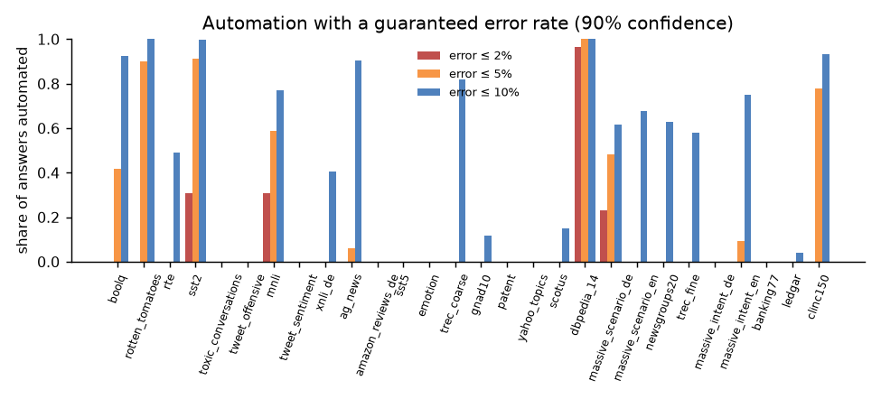
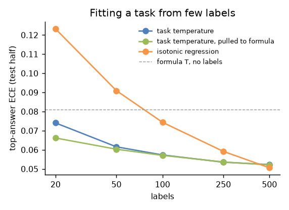

# Calibration, part 2: Jev, guaranteed automation, position bias

Follows [part 1](../part-1/README.md): same runs, same calibration/test
halves, and GLM-5.3-Flash softened by the library's default temperature (the
option-count formula, fitted without the dataset in question). Jev's
probabilities come from the published runs on the same examples. The full
tables are in [full-report.md](full-report.md).

**How ECE is reported.** ECE here is the mean over datasets of each
dataset's ECE (15 equal-size bins of top-answer confidence, test halves of
up to 500 examples). Even perfectly calibrated probabilities show some ECE
on that few examples: this **floor** is about 0.049 for GLM here. Part 1's
headline numbers subtract it (*excess ECE*), and its pooled ECE (0.024 for
the default) pools all examples across datasets before binning, which
averages the sampling noise away. The three measure the same thing, so
compare them only with their own kind; this report shows floors and excess
ECE next to the raw values.

## Results

**1. GLM with the default temperature is better calibrated than Jev, even
after the fairest fix for Jev.** On the 28 text datasets both answer, same
test halves. Jev is `jev-latest` as called on 2026-09-22; the runs didn't
record which version that resolved to.

| | GLM-5.3-Flash | Jev, raw | Jev, zeros set to 0.005 |
|---|---|---|---|
| accuracy | 78.1% | 77.5% | 77.5% |
| **no labels:** ECE / floor / **excess** | 0.081 / 0.049 / **0.032** | 0.109 / 0.030 / **0.080** | 0.127 / 0.046 / **0.082** |
| lower ECE, datasets (GLM vs fixed Jev) | 23 | | 5 |
| **~500 labels, task temperature:** ECE / excess | 0.053 / 0.006 | can't be fitted (zeros) | 0.068 / 0.019 |
| lower ECE with labels, datasets | 18 | | 10 |
| right answer priced at exactly 0 | never | 4.3% (up to 15%) | — |
| 90% sets: options, mean / median | 1.78 / 1.36 | 7.63 / 1.46 | 2.49 / 1.46 |
| 90% sets on clinc150 (151 options) | 1.07 | 151 | 18.4 |

Jev rounds to 0.01, and 61% of its probabilities are exactly 0, sometimes
including the right answer. A temperature can't move a 0, and the likelihood
of those examples is infinitely bad, so raw Jev can't be temperature-scaled.
The fix any Jev user could apply, setting zeros to half a rounding unit,
makes a temperature fittable. With labels, that gets Jev from 0.109 to 0.068,
still behind GLM's 0.053 with the same labels. Without labels the fix alone
makes Jev *worse* (0.127): every zero gets 0.005, which on a 77-option task
moves up to 0.38 of probability away from the answer Jev chose. The
rounding also inflates prediction sets where
the right answer is priced at 0: on clinc150, 151 options raw and 18 fixed,
against GLM's 1.07. Isotonic regression on Jev's top confidence reaches
0.064 with 500 labels, but it repairs only the stated confidence, not the
distribution that sets are built from.



**2. A guaranteed error rate on automated answers works, and the naive
version doesn't.** `calibrate(..., max_error=ε)` picks the confidence above
which answers are automated, so that their error stays at most ε with 90%
probability (Learn then Test: automation levels tested in order with an
exact binomial test). The obvious alternative, the threshold where the
*observed* error on your labels equals ε, broke that promise in about 40%
of samples.



A guarantee costs automation, and label errors make low ε impossible even
for confident answers. Using each dataset's whole calibration half (500
labels for most, 138–436 for the smaller ones):

| error bound ε | automated, with the guarantee | best possible, knowing the test labels |
|---|---|---|
| 2% | 6% | 31% |
| 5% | 19% | 48% |
| 10% | 42% | 63% |

No dataset exceeded ε on its test half. With a fixed number of labels, at
ε = 10%: 50 labels certify 25% of answers on average, 500 labels 39% (on
the datasets that have 500). With 20 labels nothing can be certified: even
20 correct answers don't prove 10% at 90% confidence (that takes 22).

**`calibrate()` uses the same labels twice, and it holds.** It fits the task
temperature and then the cutoffs and threshold on the same labels, which
strictly speaking breaks the guarantees' assumptions: the temperature can
change which answers count as most confident. Tested on that path (the
temperature alone, today's `bias=False`; part 3 tests the default with a
bias), with 50 to 500 labels: at most 1.4% of draws exceeded the 10% error bound
(the guarantee allows 10%), and 90% sets covered 0.904–0.918. Splitting the
labels between the two steps, which is strictly valid, cost automation: 11%
instead of 25% at 50 labels, 34% instead of 39% at 500.



**3. A task temperature from 20 labels beats the zero-label default, if it's
pulled towards it.** Top-answer ECE on the test half (floor ≈ 0.049 over all 28 datasets):

| labels | own temperature | pulled to the default | isotonic regression |
|---|---|---|---|
| 0 | 0.081 | 0.081 | — |
| 20 | 0.074 | 0.066 | 0.123 |
| 100 | 0.057 | 0.057 | 0.074 |
| 500 | 0.052 | 0.052 | 0.051 |

With 500 labels the task temperature is about 0.006 above the floor of the
23 datasets that have 500 (0.046). Pulling the fit towards the default (worth 5 examples) helps most
with 20 labels and costs nothing later; `calibrate()` does it. Isotonic
regression needs about 500 labels to catch up, so the library stays with
temperature.



**4. One cutoff can miss the rare class; one per class fixes it.** At a 90%
target, the rare class was covered only 70% of the time on
toxic_conversations (toxic, 8% of examples) and 76% on tweet_offensive.
With a cutoff per class (Mondrian conformal) it was 97–98%, at 1.4–1.5
options per set instead of 1.2–1.3. `calibrate(..., per_class=True)` does
this. A cutoff per class needs at least 9 labels of that class at 90%: with
100 labels and an 8% class that's unlikely, and such a class is then put in
every set (`Calibration.always_included`), which makes sets larger.

**5. Scanned documents need no temperature of their own.** The option
formula gives rvl_cdip (not used to fit it) T = 2.12; its own best is 2.14.
ECE falls from 0.25 to 0.096 on the test half and to 0.089 on the second run.
One image dataset is thin evidence, but there's nothing to fix yet.

**6. Position bias: no significant effect.** Every text dataset, 100 rows
each, in 4 rotated option orders (2 or 3 for datasets with fewer options):

| | accuracy | NLL, formula T | NLL, own T |
|---|---|---|---|
| one order (default) | 78.96% | 0.703 | 0.672 |
| average of all rotations (up to 4× the cost) | 78.64% | 0.685 | 0.649 |
| PriDe (prior from 10% of rows) | 78.90% | 0.705 | |

Averaging all rotations is the strongest standard position fix. Over all
2,800 rows it changes accuracy by −0.32 points, 95% interval [−1.07, +0.43]
(paired bootstrap): no evidence of a gain, and a gain above 0.4 points is
unlikely. PriDe does no better. The average does have lower NLL, and not
only because averaging softens the distribution: with each method's own
temperature it's still 0.649 against 0.672. Four orders act as a small
ensemble, a real but small calibration gain, positive on 18 of 28 datasets,
for four times the requests. On boolq with renamed options, rotating made
accuracy worse (85.0% → 82.9%): that drop comes from the option names, not
their positions.

## What changed in the library

- `calibrate(answers, labels, coverage=0.9, per_class=False, max_error=None)`
  also returns an automation threshold (`Calibration.automate(answer)`) and,
  on request, a cutoff per option, reporting options with too few labels in
  `always_included`.
- The task temperature is pulled towards the answers' current one, worth
  5 examples.
- No isotonic regression, no position prior and no document temperature:
  each was tested here and didn't beat what's there.

## Checked and dropped

- **Batch calibration** (dividing by the mean prediction of unlabelled
  traffic): −0.5 points of accuracy on average, −7 on toxic_conversations.
  It assumes balanced classes.
- **Thermometer** predicts a task's temperature from the model's hidden
  states. We could expose those from our own serving stack. But the most it
  could win is the gap between the zero-label default and a task's own
  temperature: excess ECE 0.032 against 0.006. Twenty labels with the pull
  towards the default already close about half of it (0.081 → 0.066 ECE).
  That's too little to justify serving changes.

## Reproduce

```sh
python -m bench.rotations --out runs/rotations -n 100
python -m bench.rotations --out runs/rot-boolq -n 1000 --only boolq
python -m bench.rotations --out runs/rot-boolq-renamed -n 1000 --only boolq --perturb rename
python -m bench.calibrate_extensions --run runs/r1 --second runs/r2 \
    --published <published runs>/results --summary ../part-1/summary.json \
    --rotations runs/rotations --rotations-boolq runs/rot-boolq \
    --rotations-renamed runs/rot-boolq-renamed --out report2/
```

Run a rotation command twice to fill rows lost to the rate limit. The raw
runs are in the release
[`calibration-2026-09-26`](https://github.com/edgelesssys/privatemode-decisions-benchmark/releases/tag/calibration-2026-09-26), with every run of parts 1–3, including the Kimi K2.6 and GLM-5.3 runs.
