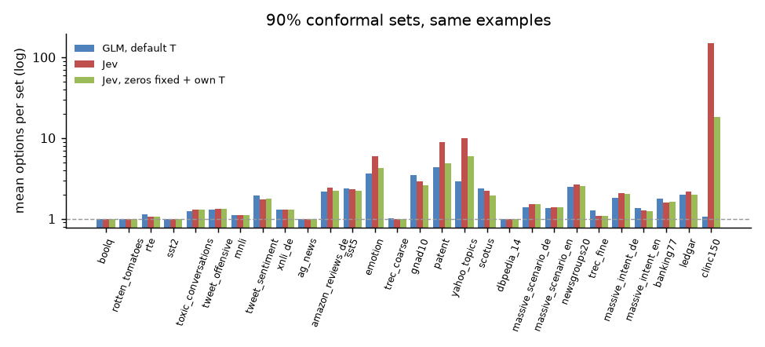

# Calibration report, part 2

Same runs, halves and temperatures as part 1 (`r1`). GLM probabilities are softened with the option-count formula fitted without the dataset in question (the library's default); Jev and Laya are taken from the published runs on the same examples. Means weight every dataset equally.

## 1. Jev on the same examples

On the 28 text datasets both systems answer, same test halves. Jev is `jev-latest` as the published runs called it on 2026-09-22; the runs did not record which version that resolved to. **ECE** here and in the rest of this report is the mean over datasets of each dataset's ECE (15 equal-size bins of top-answer confidence). Part 1's headline numbers subtract each dataset's **floor**, the ECE a perfectly calibrated model shows on the same number of examples, shown here too.

|  | GLM-5.3-Flash | Jev, raw | Jev, fairest fix |
|---|---|---|---|
| accuracy | 0.781 | 0.775 |  |
| overconfidence, no labels | +2.3 points (raw +14.6) | +10.0 points |  |
| ECE, no labels | 0.081 (default T; raw 0.149) | 0.109 | 0.127 (zeros set to 0.005) |
| sampling floor | 0.049 | 0.030 | 0.046 |
| **excess ECE, no labels** (ECE − floor) | **0.032** | **0.080** | **0.082** |
| lower ECE with no labels, datasets | 23 |  | 5 |
| ECE with the calibration half's labels (~500) | 0.053 (task T) | 0.063 (isotonic, top answer only) | 0.068 (zeros fixed + task T, median T 1.19) |
| excess ECE with labels | 0.006 |  | 0.019 |
| lower ECE with labels, datasets | 18 |  | 10 |
| probabilities exactly 0 | none | 61% |  |
| right answer at exactly 0 | never | 4.3% (max 15.4%) |  |
| 90% set: coverage | 0.908 | 0.925 | 0.910 |
| 90% set: options, mean / median | 1.78 / 1.36 | 7.63 / 1.46 | 2.49 / 1.46 |
| 90% set: options on clinc150 | 1.07 | 151.00 | 18.35 |
| 90% set: single-option share | 0.64 | 0.58 | 0.61 |

Jev rounds to 0.01, and 61% of its probabilities are exactly 0, sometimes including the right answer. Setting those zeros to half a rounding unit makes the likelihood finite, so a temperature can then be fitted: that is the fairest fix, and any Jev user could apply it. Isotonic regression repairs only the top answer's stated confidence, not the distribution that prediction sets are built from. Laya, for reference: overconfidence +17.6 points, ECE 0.204 on 27 datasets.

| dataset | options | test n | GLM acc | Jev acc | GLM ECE, default T | Jev ECE, raw | Jev ECE, zeros fixed | GLM ECE, task T | Jev ECE, zeros fixed + task T | Jev: right answer at 0 | GLM 90% set | Jev 90% set | Jev 90% set, fixed |
|---|---|---|---|---|---|---|---|---|---|---|---|---|---|
| boolq | 2 | 500 | 0.91 | 0.93 | 0.075 | 0.027 | 0.027 | 0.037 | 0.028 | 0.010 | 1.00 | 1.00 | 1.00 |
| rotten_tomatoes | 2 | 500 | 0.94 | 0.94 | 0.032 | 0.036 | 0.036 | 0.018 | 0.037 | 0.014 | 1.00 | 1.00 | 1.00 |
| rte | 2 | 139 | 0.89 | 0.90 | 0.096 | 0.076 | 0.077 | 0.074 | 0.078 | 0.007 | 1.14 | 1.06 | 1.06 |
| sst2 | 2 | 436 | 0.96 | 0.97 | 0.028 | 0.024 | 0.026 | 0.013 | 0.029 | 0.002 | 1.00 | 1.00 | 1.00 |
| toxic_conversations | 2 | 500 | 0.78 | 0.76 | 0.058 | 0.103 | 0.103 | 0.057 | 0.052 | 0.006 | 1.24 | 1.30 | 1.30 |
| tweet_offensive | 2 | 430 | 0.80 | 0.79 | 0.089 | 0.089 | 0.090 | 0.091 | 0.057 | 0.000 | 1.30 | 1.33 | 1.33 |
| mnli | 3 | 500 | 0.88 | 0.84 | 0.088 | 0.052 | 0.053 | 0.053 | 0.040 | 0.008 | 1.11 | 1.11 | 1.11 |
| tweet_sentiment | 3 | 500 | 0.68 | 0.66 | 0.087 | 0.205 | 0.202 | 0.040 | 0.073 | 0.048 | 1.94 | 1.75 | 1.77 |
| xnli_de | 3 | 500 | 0.81 | 0.79 | 0.062 | 0.110 | 0.108 | 0.043 | 0.057 | 0.016 | 1.29 | 1.29 | 1.29 |
| ag_news | 4 | 500 | 0.90 | 0.90 | 0.041 | 0.051 | 0.047 | 0.040 | 0.038 | 0.024 | 1.00 | 1.00 | 1.00 |
| amazon_reviews_de | 5 | 500 | 0.59 | 0.57 | 0.136 | 0.209 | 0.202 | 0.116 | 0.078 | 0.044 | 2.17 | 2.41 | 2.21 |
| sst5 | 5 | 500 | 0.48 | 0.57 | 0.123 | 0.178 | 0.170 | 0.086 | 0.070 | 0.030 | 2.37 | 2.33 | 2.21 |
| emotion | 6 | 500 | 0.60 | 0.58 | 0.181 | 0.290 | 0.273 | 0.050 | 0.091 | 0.154 | 3.68 | 6.00 | 4.30 |
| trec_coarse | 6 | 250 | 0.91 | 0.95 | 0.073 | 0.067 | 0.075 | 0.038 | 0.069 | 0.016 | 1.02 | 1.00 | 1.00 |
| gnad10 | 9 | 500 | 0.67 | 0.61 | 0.162 | 0.233 | 0.207 | 0.073 | 0.101 | 0.090 | 3.50 | 2.92 | 2.60 |
| patent | 9 | 500 | 0.55 | 0.48 | 0.165 | 0.259 | 0.237 | 0.065 | 0.062 | 0.140 | 4.31 | 9.00 | 4.82 |
| yahoo_topics | 10 | 500 | 0.76 | 0.75 | 0.082 | 0.137 | 0.114 | 0.050 | 0.079 | 0.106 | 2.89 | 10.00 | 5.97 |
| scotus | 13 | 500 | 0.68 | 0.71 | 0.132 | 0.167 | 0.128 | 0.065 | 0.092 | 0.108 | 2.40 | 2.21 | 1.94 |
| dbpedia_14 | 14 | 500 | 0.98 | 0.99 | 0.027 | 0.005 | 0.055 | 0.017 | 0.012 | 0.002 | 1.00 | 1.00 | 1.00 |
| massive_scenario_de | 18 | 500 | 0.74 | 0.73 | 0.049 | 0.105 | 0.094 | 0.073 | 0.102 | 0.024 | 1.40 | 1.53 | 1.52 |
| massive_scenario_en | 18 | 500 | 0.76 | 0.74 | 0.049 | 0.098 | 0.072 | 0.061 | 0.082 | 0.026 | 1.36 | 1.39 | 1.40 |
| newsgroups20 | 20 | 500 | 0.73 | 0.72 | 0.061 | 0.081 | 0.093 | 0.057 | 0.093 | 0.024 | 2.49 | 2.67 | 2.52 |
| trec_fine | 42 | 250 | 0.80 | 0.83 | 0.089 | 0.067 | 0.118 | 0.083 | 0.087 | 0.008 | 1.28 | 1.10 | 1.09 |
| massive_intent_de | 59 | 500 | 0.80 | 0.79 | 0.034 | 0.079 | 0.134 | 0.034 | 0.083 | 0.030 | 1.82 | 2.09 | 2.01 |
| massive_intent_en | 59 | 500 | 0.82 | 0.83 | 0.040 | 0.057 | 0.140 | 0.025 | 0.055 | 0.042 | 1.35 | 1.26 | 1.25 |
| banking77 | 77 | 500 | 0.81 | 0.80 | 0.057 | 0.087 | 0.166 | 0.050 | 0.086 | 0.058 | 1.79 | 1.58 | 1.62 |
| ledgar | 100 | 500 | 0.77 | 0.78 | 0.085 | 0.077 | 0.207 | 0.061 | 0.055 | 0.056 | 1.98 | 2.17 | 2.01 |
| clinc150 | 151 | 500 | 0.88 | 0.80 | 0.066 | 0.089 | 0.311 | 0.029 | 0.124 | 0.118 | 1.07 | 151.00 | 18.35 |

## 2. A guaranteed error rate on automated answers

Learn then Test style: from a task's calibration half, the lowest threshold on the top probability whose error among automated answers is at most ε, with probability 90% over the choice of labels. Evaluated on the test half. This table uses each dataset's whole calibration half, 138 to 500 labels, so its rates differ from the fixed-size draws below.

| max error ε | mean share automated | best possible (knowing the test labels) | datasets automating anything | datasets over ε on the test half |
|---|---|---|---|---|
| 2% | 6% | 31% | 4 of 28 | 0 of 28 |
| 5% | 19% | 48% | 9 of 28 | 0 of 28 |
| 10% | 42% | 63% | 18 of 28 | 0 of 28 |

The gap to the best possible is the price of a guarantee from ~500 labels: to certify ε from n answers, their observed error has to be well below ε. Label errors keep even the most confident answers from being error-free, so ε of a few percent is out of reach on most tasks.

Per dataset, share automated (error among automated on the test half):

| dataset | options | accuracy | ε = 2% | ε = 5% | ε = 10% |
|---|---|---|---|---|---|
| boolq | 2 | 0.91 | 0% (0.0%) | 42% (1.9%) | 92% (5.4%) |
| rotten_tomatoes | 2 | 0.94 | 0% (0.0%) | 90% (3.3%) | 100% (6.0%) |
| rte | 2 | 0.89 | 0% (0.0%) | 0% (0.0%) | 49% (2.9%) |
| sst2 | 2 | 0.96 | 31% (0.0%) | 91% (1.8%) | 100% (4.1%) |
| toxic_conversations | 2 | 0.78 | 0% (0.0%) | 0% (0.0%) | 0% (0.0%) |
| tweet_offensive | 2 | 0.80 | 0% (0.0%) | 0% (0.0%) | 0% (0.0%) |
| mnli | 3 | 0.88 | 31% (1.9%) | 59% (4.8%) | 77% (7.8%) |
| tweet_sentiment | 3 | 0.68 | 0% (0.0%) | 0% (0.0%) | 0% (0.0%) |
| xnli_de | 3 | 0.81 | 0% (0.0%) | 0% (0.0%) | 41% (5.9%) |
| ag_news | 4 | 0.90 | 0% (0.0%) | 6% (0.0%) | 91% (8.2%) |
| amazon_reviews_de | 5 | 0.59 | 0% (0.0%) | 0% (0.0%) | 0% (0.0%) |
| sst5 | 5 | 0.48 | 0% (0.0%) | 0% (0.0%) | 0% (0.0%) |
| emotion | 6 | 0.60 | 0% (0.0%) | 0% (0.0%) | 0% (0.0%) |
| trec_coarse | 6 | 0.91 | 0% (0.0%) | 0% (0.0%) | 82% (3.4%) |
| gnad10 | 9 | 0.67 | 0% (0.0%) | 0% (0.0%) | 12% (5.1%) |
| patent | 9 | 0.55 | 0% (0.0%) | 0% (0.0%) | 0% (0.0%) |
| yahoo_topics | 10 | 0.76 | 0% (0.0%) | 0% (0.0%) | 0% (0.0%) |
| scotus | 13 | 0.68 | 0% (0.0%) | 0% (0.0%) | 15% (6.8%) |
| dbpedia_14 | 14 | 0.98 | 97% (1.0%) | 100% (2.0%) | 100% (2.0%) |
| massive_scenario_de | 18 | 0.74 | 23% (0.0%) | 48% (2.9%) | 62% (6.5%) |
| massive_scenario_en | 18 | 0.76 | 0% (0.0%) | 0% (0.0%) | 68% (9.8%) |
| newsgroups20 | 20 | 0.73 | 0% (0.0%) | 0% (0.0%) | 63% (6.7%) |
| trec_fine | 42 | 0.80 | 0% (0.0%) | 0% (0.0%) | 58% (6.9%) |
| massive_intent_de | 59 | 0.80 | 0% (0.0%) | 0% (0.0%) | 0% (0.0%) |
| massive_intent_en | 59 | 0.82 | 0% (0.0%) | 9% (2.1%) | 75% (6.1%) |
| banking77 | 77 | 0.81 | 0% (0.0%) | 0% (0.0%) | 0% (0.0%) |
| ledgar | 100 | 0.77 | 0% (0.0%) | 0% (0.0%) | 4% (4.8%) |
| clinc150 | 151 | 0.88 | 0% (0.0%) | 78% (4.1%) | 93% (9.4%) |

**Labels needed, and does calibrate() keep the promise?** ε = 10%, 50 random draws of n labels per dataset (only datasets whose calibration half has at least n). A violation is a test half whose error among automated answers exceeds 10%; the guarantee allows 10% of draws, plus test-half sampling noise. Three ways to use the labels: *default T* uses them only for the threshold; *calibrate()* first fits the task temperature on the same labels, which strictly speaking uses them twice; *split* fits the temperature on half and the threshold on the other half, which is strictly valid. The last columns are calibrate()'s 90% set coverage on the same draws, and the naive rule (the lowest threshold whose observed error is at most 10%):

| labels | automated, default T | violations | automated, calibrate() | violations | automated, split | violations | 90% set coverage, calibrate() | violations, naive threshold |
|---|---|---|---|---|---|---|---|---|
| 20 | 0% | 0.0% | 0% | 0.0% | 0% | 0.0% | 0.918 | 40.1% |
| 50 | 25% | 1.3% | 25% | 0.9% | 11% | 1.1% | 0.909 | 44.4% |
| 100 | 27% | 1.5% | 27% | 1.4% | 23% | 1.4% | 0.909 | 41.6% |
| 250 | 37% | 1.5% | 37% | 1.4% | 29% | 1.4% | 0.906 | 42.4% |
| 500 | 39% | 0.0% | 39% | 0.0% | 34% | 1.3% | 0.904 | 39.1% |

Fitting one temperature on the same labels: at most 1.4% of draws over the bound (10% allowed) and 90% sets covering 0.904–0.918; splitting the labels between the two steps changes the share automated by -6 points on average.

## 3. Fitting a task from a few labels: temperature or isotonic regression

Top-answer ECE on the test half, from n random labels of the calibration half (50 draws per dataset; formula T is the zero-label default, isotonic regression is fitted on the formula-T confidence):

| labels | task temperature | task temperature, pulled to the formula | isotonic regression |
|---|---|---|---|
| 0 (formula T) | 0.081 | 0.081 | — |
| 20 | 0.074 | 0.066 | 0.123 |
| 50 | 0.062 | 0.060 | 0.091 |
| 100 | 0.057 | 0.057 | 0.074 |
| 250 | 0.054 | 0.054 | 0.059 |
| 500 | 0.052 | 0.052 | 0.051 |

The sampling floor of these test halves is about 0.049: a perfectly calibrated model would show that much ECE on them. The pulled task temperature from 500 labels reaches 0.052.

The pull is worth 5 examples (`calibrate()` does the same, towards the temperature the answers already have). Isotonic regression catches up with the temperature from 500 labels on.

## 4. Coverage per class on imbalanced tasks

Binary tasks whose rarer class is under 35%. With one cutoff, 90% coverage holds on average but can fail for the rare class, often the one that matters. A cutoff per class (Mondrian conformal) restores it at the cost of larger sets:

| dataset | rare class | rare-class coverage, one cutoff | rare-class coverage, per class | mean set, one cutoff | mean set, per class |
|---|---|---|---|---|---|
| toxic_conversations | toxic (8%) | 0.697 | 0.970 | 1.24 | 1.51 |
| tweet_offensive | offensive (28%) | 0.760 | 0.977 | 1.30 | 1.42 |

## 5. Scanned documents

rvl_cdip (16 options) was not used to fit the formula. Its own best T is 2.14, the formula gives 2.12:

| rvl_cdip test half | ECE | overconfidence |
|---|---|---|
| raw | 0.248 | 0.248 |
| formula T = 2.12 | 0.096 | 0.071 |
| own T = 2.14 | 0.094 | 0.065 |
| formula T, run 2 | 0.089 | 0.070 |

## 6. Position bias: rotations and PriDe

Every row asked in 2/3/4 rotated option orders (about 100 rows per text dataset). Compared on the same rows, after the formula T: one order (the default), the average of all rotations (4× the cost; the strongest standard position fix), and PriDe (position prior estimated from 10% of the rows in all rotations, applied to the other 90% at the cost of one order).

| method | mean accuracy | points vs one order | mean NLL | mean ECE |
|---|---|---|---|---|
| one order | 0.7896 | +0.00 | 0.703 | 0.117 |
| all rotations | 0.7864 | -0.32 | 0.685 | 0.121 |
| PriDe | 0.7890 | -0.06 | 0.705 | 0.124 |

**No significant difference.** Over all 2800 rows, all rotations minus one order is -0.32 points of accuracy, 95% interval [-1.07, +0.43] (paired bootstrap): a gain of more than 0.4 points is unlikely. PriDe: 0.7890 mean accuracy. On the 10 datasets with at most 4 options, where 4 rotations cover every position, accuracy is 0.852 for one order, 0.846 for all rotations and 0.851 for PriDe. Averaging also softens the distribution; with each method's own temperature, which takes that out, NLL is 0.672 for one order and 0.649 for all rotations. With more options than rotations the position prior can't be separated from content, which limits PriDe on the many-option sets.

Per dataset, accuracy / NLL; the last column is how much more the model likes its favourite position than its least favourite, shown only where the rotations cover every position:

| dataset | options | rows | one order (acc / NLL) | all rotations (acc / NLL) | PriDe (acc / NLL) | position preference, max/min |
|---|---|---|---|---|---|---|
| boolq | 2 | 100 | 0.92 / 0.28 | 0.92 / 0.26 | 0.92 / 0.27 | 1.54 |
| rotten_tomatoes | 2 | 100 | 0.94 / 0.18 | 0.95 / 0.18 | 0.95 / 0.19 | 1.93 |
| rte | 2 | 100 | 0.83 / 0.39 | 0.83 / 0.38 | 0.83 / 0.40 | 1.15 |
| sst2 | 2 | 100 | 0.93 / 0.18 | 0.93 / 0.18 | 0.92 / 0.19 | 1.76 |
| toxic_conversations | 2 | 100 | 0.85 / 0.40 | 0.85 / 0.37 | 0.85 / 0.38 | 1.30 |
| tweet_offensive | 2 | 100 | 0.74 / 0.53 | 0.74 / 0.52 | 0.74 / 0.53 | 1.03 |
| mnli | 3 | 100 | 0.85 / 0.38 | 0.83 / 0.39 | 0.84 / 0.38 | 1.36 |
| tweet_sentiment | 3 | 100 | 0.76 / 0.77 | 0.72 / 0.76 | 0.76 / 0.77 | 1.04 |
| xnli_de | 3 | 100 | 0.78 / 0.61 | 0.75 / 0.61 | 0.78 / 0.61 | 1.38 |
| ag_news | 4 | 100 | 0.92 / 0.26 | 0.94 / 0.23 | 0.92 / 0.25 | 1.94 |
| amazon_reviews_de | 5 | 100 | 0.58 / 0.97 | 0.59 / 0.96 | 0.62 / 0.96 | — |
| sst5 | 5 | 100 | 0.51 / 1.10 | 0.53 / 1.08 | 0.56 / 1.08 | — |
| emotion | 6 | 100 | 0.61 / 1.46 | 0.59 / 1.43 | 0.62 / 1.44 | — |
| trec_coarse | 6 | 100 | 0.93 / 0.32 | 0.94 / 0.36 | 0.91 / 0.34 | — |
| gnad10 | 9 | 100 | 0.72 / 1.06 | 0.71 / 0.98 | 0.73 / 1.08 | — |
| patent | 9 | 100 | 0.55 / 1.38 | 0.54 / 1.36 | 0.55 / 1.34 | — |
| yahoo_topics | 10 | 100 | 0.74 / 1.13 | 0.72 / 1.17 | 0.74 / 1.11 | — |
| scotus | 13 | 100 | 0.70 / 1.20 | 0.69 / 1.11 | 0.71 / 1.23 | — |
| dbpedia_14 | 14 | 100 | 0.99 / 0.07 | 1.00 / 0.06 | 0.99 / 0.06 | — |
| massive_scenario_de | 18 | 100 | 0.79 / 0.70 | 0.78 / 0.70 | 0.78 / 0.68 | — |
| massive_scenario_en | 18 | 100 | 0.80 / 0.70 | 0.78 / 0.73 | 0.79 / 0.70 | — |
| newsgroups20 | 20 | 100 | 0.69 / 1.03 | 0.72 / 0.93 | 0.67 / 1.09 | — |
| trec_fine | 42 | 100 | 0.78 / 0.74 | 0.82 / 0.75 | 0.79 / 0.75 | — |
| massive_intent_de | 59 | 100 | 0.83 / 0.72 | 0.80 / 0.71 | 0.79 / 0.78 | — |
| massive_intent_en | 59 | 100 | 0.91 / 0.53 | 0.88 / 0.55 | 0.89 / 0.58 | — |
| banking77 | 77 | 100 | 0.76 / 1.26 | 0.76 / 1.16 | 0.76 / 1.21 | — |
| ledgar | 100 | 100 | 0.81 / 0.83 | 0.84 / 0.70 | 0.80 / 0.79 | — |
| clinc150 | 151 | 100 | 0.89 / 0.52 | 0.87 / 0.53 | 0.87 / 0.58 | — |

**boolq, renamed options** (`true`/`false` → `correct`/`wrong`, all rows, 2 rotations each):

| options | one order | all rotations | PriDe (5% to estimate) |
|---|---|---|---|
| original | 0.915 | 0.919 | 0.915 |
| renamed | 0.850 | 0.829 | 0.818 |

Renaming costs 6.5 points in one order; rotating the renamed options changes that by -2.1. A drop that comes from the option *names* rather than their positions is one a position fix can't recover.

## Figures

