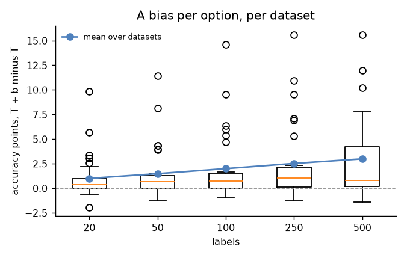
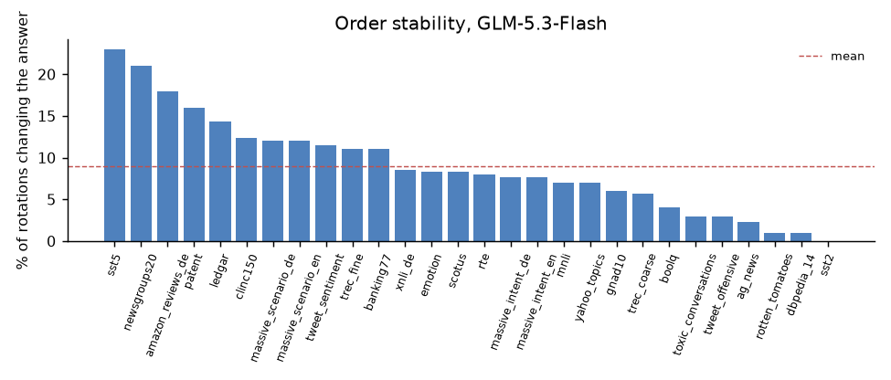

# Calibration, part 3: a bias per option, option orders, many options, other models

Follows [part 1](../part-1/README.md) and [part 2](../part-2/README.md): same
runs, same calibration/test halves, and GLM-5.3-Flash starting from the
library's default temperature (the option-count formula, fitted without the
dataset in question). Jev's probabilities come from the published runs on
the same examples, and every method applied to GLM is applied to Jev too.
The full tables are in [full-report.md](full-report.md); the other models'
part-1 reports are in [kimi-k2.6/](kimi-k2.6/) and [glm-5.3/](glm-5.3/).

ECE is reported as in part 2: the mean over datasets of each dataset's ECE,
and *excess ECE*, which subtracts the floor that sampling alone produces on
the same number of examples (0 is as calibrated as the sample can show).

## Results

**1. A bias per option gains accuracy, and `calibrate()` now fits one.**
`softmax(log p / T + b)`: next to the task temperature, one bias per option,
fitted together on the same labels, pulled towards 0 with a strength worth 2
examples. It corrects a model that favours an option regardless of the
input, so unlike a temperature it changes answers. On the 28 text datasets
(20 random draws of n labels from each calibration half, scored on the test
half):

| labels | accuracy, T only (part 2) | accuracy, T + bias | better / worse datasets | worst dataset | NLL | excess ECE |
|---|---|---|---|---|---|---|
| 20 | 78.1% | 79.1% (+1.0) | 16 / 6 | −1.9 | 0.691 → 0.665 | 0.017 → 0.013 |
| 50 | 78.1% | 79.6% (+1.5) | 17 / 7 | −1.2 | 0.686 → 0.648 | 0.013 → 0.007 |
| 100 | 78.1% | 80.1% (+2.0) | 18 / 6 | −0.9 | 0.683 → 0.631 | 0.008 → 0.004 |
| 250 | 77.7% | 80.2% (+2.5) | 20 / 4 | −1.3 | 0.694 → 0.625 | 0.006 → 0.005 |
| 500 | 76.1% | 79.1% (+3.0) | 19 / 3 | −1.4 | 0.745 → 0.657 | 0.006 → 0.003 |

(At 500 labels only the 23 datasets with that many calibration examples
count, hence the lower baseline.) The largest gains are where the model
over-predicts a class: toxic_conversations +14.6 points at 100 labels, sst5
+9.5, massive_scenario +6. The gain holds in every option-count band, +0.7
points above 20 options, where the pull keeps a few hundred labels from
fitting a hundred biases too far; one strength fits all option counts. For
two options this is Platt scaling, which openjev applies on its server to
yes/no questions: it helps toxic_conversations (78% → 93%) and moves the
other binary tasks by less than a point either way.



**2. With a bias, cutoffs and thresholds must be set out-of-fold.** Part 2
fitted the temperature on the same labels as the cutoffs and the automation
threshold, and that held. A bias has one parameter per option, and on the
labels it was fitted to the answers look better than they are: the error
bound on automated answers broke on 2 of 23 datasets at 500 labels (8.7% of
draws, against 0.0% for a temperature alone). `calibrate()` now sets the
cutoffs and threshold on out-of-fold probabilities (each labelled answer
corrected by a fit on the other four of five folds) and the final correction
on all labels:

| labels | T only, same labels (part 2) | T + bias, same labels | **T + bias, out-of-fold (shipped)** |
|---|---|---|---|
| 50 | 25% automated / 0.9% over ε / coverage 0.908 | 29% / 1.8% / 0.903 | 21% / 0.9% / 0.915 |
| 100 | 27% / 1.1% / 0.909 | 33% / 2.3% / 0.907 | 23% / 0.9% / 0.915 |
| 250 | 38% / 0.6% / 0.907 | 43% / 4.4% / 0.907 | 31% / 1.1% / 0.912 |
| 500 | 39% / 0.0% / 0.904 | 46% / 8.7% / 0.905 | 36% / 1.1% / 0.909 |

Automated share at ε = 10%, share of draws whose automated error on the test
half exceeded 10% (the guarantee allows 10%), and 90% set coverage. The
out-of-fold path keeps both guarantees and makes 90% sets smaller (1.70
options instead of 1.85 at 100 labels), at a price in automation: 23%
instead of 27% at 100 labels. `calibrate(..., bias=False)` keeps part 2's
behaviour for whoever needs the most automation more than accuracy. **Gate:
passed** (more accuracy at 100 labels, coverage and error bound no worse).

**3. Jev gains the same from the same method, and stays behind.** Jev's
zeros set to half a rounding unit first (part 2's fairest fix), starting
from Jev's own zero-label default temperature (the option formula fitted on
Jev's per-task temperatures, as in the [overview](../README.md)), then the
same fit and the same out-of-fold cutoffs, on the same examples:

| labels | | accuracy, T | accuracy, T + bias | excess ECE, T → T + bias | 90% set, T + bias | automated at ε = 10%, T + bias |
|---|---|---|---|---|---|---|
| 100 | GLM-5.3-Flash | 78.1% | **80.2%** | 0.008 → **0.005** | **1.71** | 23% |
| 100 | Jev | 77.5% | 79.6% | 0.023 → 0.014 | 1.79 | 25% |
| 500 | GLM-5.3-Flash | 76.1% | **79.1%** | 0.006 → **0.003** | **1.64** | 35% |
| 500 | Jev | 75.1% | 78.7% | 0.022 → 0.007 | 1.67 | 36% |

Both gain about 2 points at 100 labels and 3.5 at 500. After calibration GLM
is 0.6 points ahead at 100 labels and 0.4 at 500, better calibrated (excess
ECE 0.005 against 0.014), with smaller sets, and automates about the same
share. Both kept the error bound (0.4% and 3.0% of draws over ε at 100
labels).

**4. Several option orders keep the one-order temperature.**
`SystemOne(permutations=k)` averages k rotated orders. From the rotation
runs (28 text datasets, 100 rows, 4 orders), with the orders the library
asks for k = 2 and 4:

| orders | NLL, one-order default T | NLL, formula fitted for k orders (LODO) | NLL, T per dataset | accuracy |
|---|---|---|---|---|
| 1 | 0.703 | — | 0.672 | 78.96% |
| 2 | **0.690** | 0.712 | 0.658 | 78.93% |
| 4 | **0.685** | 0.706 | 0.649 | 78.64% |

Averaging softens, so a task's best T falls (median ratio 0.95 for 2
orders, 0.91 for 4), but a formula fitted for k orders was worse than the
one-order formula on held-out datasets: 100 rows per dataset are too few to
fit it. The library keeps the one-order default and says so; a task's own
temperature from `calibrate()` on answers asked the same way gets the rest
(0.649). The ensemble's worth after its own temperature is small: NLL 0.672
→ 0.649 and 61% → 65% of answers automatable at 10% observed error, for 4×
the requests, with no accuracy gain.

**Re-reading only uncertain answers** (as razorback16/openjev does, above
0.1 nats of entropy): with rotations, re-reading the 34% of answers above
0.1 nats (+102% requests) changed accuracy by −0.35 points and NLL by −0.004.
Not worth it.

**5. Order stability.** GLM-5.3-Flash changes its answer in 9.0% of option
rotations (median 8.2%): most on sst5 (23%), newsgroups20 (21%) and
amazon_reviews_de (18%), least on sst2, dbpedia_14 and rotten_tomatoes
(0–1%). openjev reports 18.5% for its untuned base and 2.3% after
fine-tuning, measured by shuffling its own questions, so the comparison is
indicative only.



**6. Many options, few labels: no clustering beats one cutoff.** On the six
text datasets with more than 20 options, 20 random 50/50 splits (about 500
labels):

| cutoffs | coverage | options per set | class gap | classes under 80% |
|---|---|---|---|---|
| one cutoff | 0.900 | 1.60 | 0.120 | 15% |
| one per class (`per_class=True`) | 0.972 | 70.0 | 0.089 | 0% |
| clustered (Ding et al. 2023) | 0.907 | 1.78 | 0.115 | 14% |
| grouped by the unlabelled answers | 0.905 | 2.68 | 0.107 | 15% |

*Class gap* is the mean distance of a class's coverage from 90%. A cutoff
per class covers every class, but with a few labels per class most options
are in every set (70 options on average). Clustered conformal, which pools
classes whose scores behave alike, needs about ten labels per class to
describe a class; with 3–10 it barely differs from one cutoff. Grouping
classes by the unlabelled answers instead uses every label for the cutoffs,
but gains little. Neither ships. With many options and few labels, one
cutoff is the practical choice; `per_class=True` is for a few options with a
rare one. Jev with the same cutoffs: 3.5 options per set with one cutoff
against GLM's 1.6, and the same class gap.

**7. Known class rates without labels: not shipped.** Correcting answers by
class rates known from logs (`p′ ∝ p · π / π̂`, π̂ the mean answer on
unlabelled traffic) gains +2.5 points on datasets up to 20 options when the
rates are within 25%, but only +1.8 with 8 of 20 datasets worse when they
are up to 2× off. The bias from 100 labels gains +2.3 with 5 worse, and needs
no rates. Anyone who can state the rates that precisely can label 100
examples, so the library leaves it out.

**8. Other models.** One run each of `kimi-latest` and `glm-latest` on all
29 datasets (up to 1,000 examples, 4 in flight), same halves, with
`bench.calibrate_report` as in part 1. Every row now records the model the
endpoint says answered and its build (`served_model`, `fingerprint`): the
aliases resolved to `kimi-k2.6` and `glm-5.3`.

| model | text accuracy | option mass | overconfidence, raw | T per task, median (range) | formula slope b | excess ECE: raw → default (LODO) → T per task | whole family held out | rvl_cdip | latency p50 |
|---|---|---|---|---|---|---|---|---|---|
| GLM-5.3-Flash (part 1) | 78.0% | 0.97 | +14.6 | 2.03 (1.36–3.74) | −0.086 | 0.129 → 0.032 → 0.006 | 0.054 | 69.6% | 270 ms |
| Kimi K2.6 | **78.9%** | **1.00** | +13.8 | 2.17 (1.43–4.95) | −0.099 | 0.121 → **0.025** → 0.009 | 0.029 | **81.8%** | 1,550 ms |
| GLM-5.3 | 76.9% | 0.64 | +14.5 | 1.96 (0.68–3.66) | −0.015 | 0.127 → 0.049 → 0.011 | 0.079 | text only | 330 ms |

Latency is the median over datasets at 4 requests in flight, from these
runs, not the suite's concurrency-1 measurement.

- **Kimi K2.6 needs the same recipe as GLM Flash.** Overconfident on all 28
  datasets, and its best temperature falls with the option count in the same
  way (slope −0.099 against −0.086), so the option formula recovers 79% of
  the per-task gain (71% for Flash), and still 73% with a whole task family
  held out. It is slightly more accurate on text, much better on scanned
  documents (81.8% against 69.6%; its own T there is 1.96, the formula
  gives 2.24), and about six times slower.
- **GLM-5.3 doesn't share the shape.** Its best temperature doesn't depend
  on the option count (slope −0.015, correlation −0.05), so the formula is
  effectively one temperature of about 2.0, and one global T does as well
  (excess ECE 0.045 against 0.049). With its family held out the default
  recovers only 22% of the gain: for GLM-5.3, labels matter more.
- **GLM-5.3 wants a space after `answer=`**, as Flash did after `answer:`:
  only 64% of its probability lands on the options (on one ag_news example,
  0.53 on a space and 0.47 on the digit). The probabilities the library
  returns are still what the temperatures were fitted on, so the defaults
  apply, but the read is conditioned on a token the model often doesn't
  choose. A prefill per model is a follow-up for the accuracy work, and needs
  a rerun of these temperatures. It also can't read images: all 1,000
  rvl_cdip requests were rejected as "not a multimodal model".

The generated constants ship in the library for both, with their aliases.
Their full reports are in [kimi-k2.6/full-report.md](kimi-k2.6/full-report.md)
and [glm-5.3/full-report.md](glm-5.3/full-report.md).

## What changed in the library

- `calibrate(answers, labels, ..., bias=True)` fits a bias per option next
  to the temperature (`fit_temperature_bias`), and sets cutoffs and
  thresholds on out-of-fold probabilities. `Calibration.apply(answer)`
  returns the corrected answer, whose choice can differ; `predict_set`,
  `automate` and `evaluate` use it. `bias=False` is part 2's behaviour.
- Default temperatures for Kimi K2.6 and GLM-5.3, generated from their reports,
  with `glm-latest` and `kimi-latest` as aliases.
- `permutations > 1` documented to keep the one-order temperature.
- An audit loop example (`examples/audit_loop.py`), and the README says
  which guarantee holds when and why calibration runs in the client.

## Checked and dropped

- A temperature formula per number of option orders (worse than the
  one-order formula on held-out datasets).
- Re-reading uncertain answers in more orders (no accuracy, little NLL).
- Clustered conformal and grouping by answers (no better than one cutoff
  at a few labels per class).
- Correcting by known class rates (needs rates as good as 100 labels).

## Not done

- **The open Jev reimplementations** (razorback16/openjev, openjev/openjev):
  no endpoint or key was available for this run, and openjev's weights are
  CC BY-NC 4.0, which needs a decision on whether an internal benchmark is
  commercial use.
- **A person's label check.** `bench.label_page` builds the page for it
  (command below): the 80 flagged banking77 examples, both labels in random
  order, no LLM verdict shown. Its export is read by
  `bench.calibrate_report --label-check`. Part 1 still uses Claude's
  verdicts.
- **A second image dataset**: needs a document set with public labels and a
  license to use, which is a decision to make first.
- **The final test on untouched tasks** runs once the calibration code and
  constants are final, which includes the outcome of the accuracy plan.
  What will be measured and what counts as a pass is written down in
  [holdout-plan.md](holdout-plan.md), before any task was chosen.
- **The prompt regression check** belongs to the accuracy plan: a prompt
  change needs part 1 rerun and the constants regenerated.

## Reproduce

```sh
# other models (one run each, 4 in flight; resolved model and build are recorded per row)
DECISIONS_MODEL=kimi-latest python -m bench.suite -n 1000 --replicates 1 --arms privatemode \
    --concurrency 4 --out runs/kimi
DECISIONS_MODEL=glm-latest python -m bench.suite -n 1000 --replicates 1 --arms privatemode \
    --concurrency 4 --skip rvl_cdip --out runs/glm
python -m bench.calibrate_report --run runs/kimi --out kimi-k2.6/ \
    --source results/calibration/part-3/kimi-k2.6/constants.json
python -m bench.calibrate_report --run runs/glm --out glm-5.3/ \
    --source results/calibration/part-3/glm-5.3/constants.json
# this report
python -m bench.calibrate_part3 --run runs/r1 --summary ../part-1/summary.json \
    --published <published runs>/results --rotations runs/rotations \
    --model kimi-k2.6=runs/kimi --model glm-5.3=runs/glm --out report3/
# the labelling page
python -m bench.label_page ../part-1/banking77-label-check.json <somewhere>/label-check.html
```

Then, in the library, `python scripts/update_calibration.py` with each
`constants.json`. The raw runs will be in the release
`calibration-2026-09-26` (not yet published), with every run of parts 1–3, including the Kimi K2.6 and GLM-5.3 runs.
