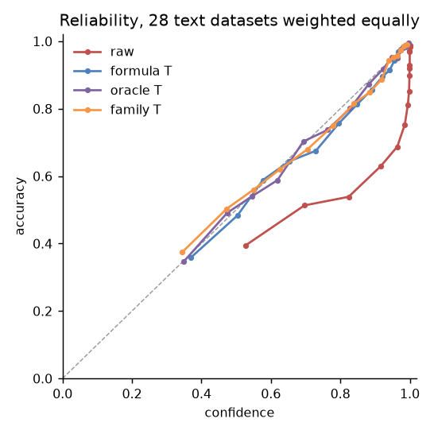
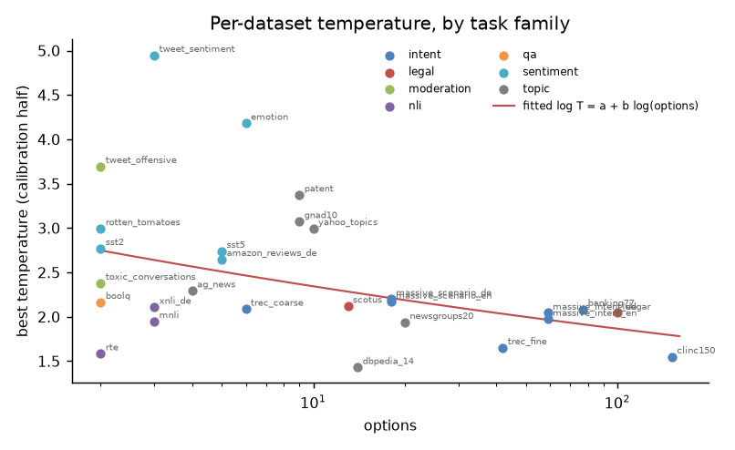
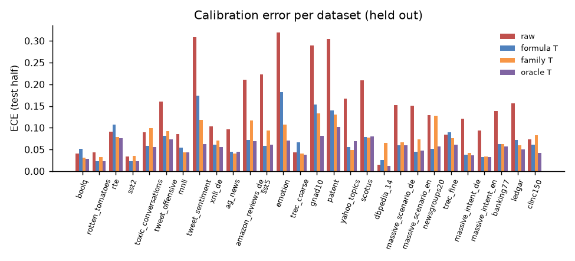
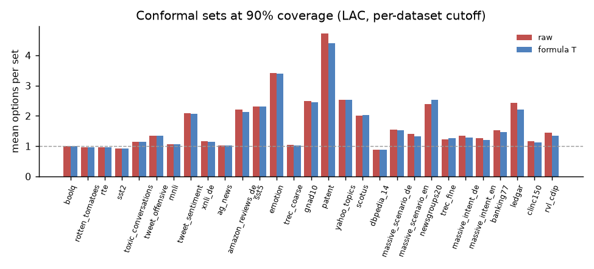
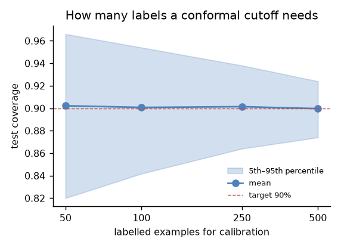
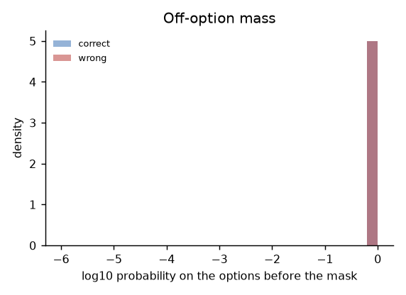

# Calibration report

Run: `kimi-latest`, 28 text datasets plus rvl_cdip (scanned documents), reported separately. Calibration/test halves are a fixed random split, seed 0. ECE uses 15 equal-mass bins of top-label confidence; means over datasets weight every dataset equally.

## 1. Raw probabilities

Raw probabilities are **overconfident by 13.8 points** on average (mean confidence minus accuracy, text datasets, test halves); pooled ECE 0.138. Overconfident on 28 of 28 text datasets.

| dataset | options | test n | accuracy | confidence | overconfidence | ECE [95% CI] | NLL | Brier |
|---|---|---|---|---|---|---|---|---|
| boolq | 2 | 500 | 0.92 | 0.96 | 0.040 | 0.040 [0.023, 0.065] | 0.261 | 0.121 |
| rotten_tomatoes | 2 | 500 | 0.95 | 0.99 | 0.043 | 0.043 [0.025, 0.064] | 0.342 | 0.101 |
| rte (small) | 2 | 139 | 0.89 | 0.95 | 0.061 | 0.090 [0.045, 0.128] | 0.332 | 0.167 |
| sst2 | 2 | 436 | 0.96 | 0.99 | 0.034 | 0.034 [0.018, 0.055] | 0.226 | 0.074 |
| toxic_conversations | 2 | 500 | 0.85 | 0.92 | 0.071 | 0.090 [0.066, 0.119] | 0.515 | 0.248 |
| tweet_offensive | 2 | 430 | 0.77 | 0.93 | 0.159 | 0.160 [0.127, 0.198] | 0.771 | 0.381 |
| mnli | 3 | 500 | 0.87 | 0.96 | 0.085 | 0.086 [0.062, 0.113] | 0.449 | 0.214 |
| tweet_sentiment | 3 | 500 | 0.61 | 0.92 | 0.309 | 0.309 [0.268, 0.346] | 1.940 | 0.681 |
| xnli_de | 3 | 500 | 0.86 | 0.95 | 0.091 | 0.103 [0.075, 0.136] | 0.603 | 0.252 |
| ag_news | 4 | 500 | 0.86 | 0.95 | 0.097 | 0.097 [0.071, 0.126] | 0.516 | 0.211 |
| amazon_reviews_de | 5 | 500 | 0.64 | 0.85 | 0.210 | 0.210 [0.174, 0.255] | 1.302 | 0.566 |
| sst5 | 5 | 500 | 0.58 | 0.80 | 0.215 | 0.223 [0.186, 0.266] | 1.317 | 0.625 |
| emotion | 6 | 500 | 0.62 | 0.94 | 0.319 | 0.319 [0.277, 0.363] | 2.652 | 0.705 |
| trec_coarse (small) | 6 | 250 | 0.92 | 0.96 | 0.043 | 0.044 [0.024, 0.077] | 0.324 | 0.127 |
| gnad10 | 9 | 500 | 0.63 | 0.92 | 0.289 | 0.289 [0.252, 0.327] | 2.104 | 0.637 |
| patent | 9 | 500 | 0.55 | 0.85 | 0.305 | 0.305 [0.266, 0.345] | 2.669 | 0.757 |
| yahoo_topics | 10 | 500 | 0.76 | 0.93 | 0.167 | 0.167 [0.136, 0.203] | 1.620 | 0.407 |
| scotus | 13 | 500 | 0.69 | 0.89 | 0.209 | 0.209 [0.171, 0.249] | 1.678 | 0.495 |
| dbpedia_14 | 14 | 500 | 0.98 | 0.99 | 0.014 | 0.014 [0.005, 0.025] | 0.093 | 0.031 |
| massive_scenario_de | 18 | 500 | 0.76 | 0.91 | 0.152 | 0.152 [0.116, 0.185] | 1.056 | 0.382 |
| massive_scenario_en | 18 | 500 | 0.77 | 0.92 | 0.151 | 0.151 [0.120, 0.180] | 1.005 | 0.361 |
| newsgroups20 | 20 | 500 | 0.75 | 0.88 | 0.128 | 0.128 [0.103, 0.159] | 1.062 | 0.365 |
| trec_fine (small) | 42 | 250 | 0.82 | 0.89 | 0.078 | 0.084 [0.056, 0.133] | 0.778 | 0.290 |
| massive_intent_de | 59 | 500 | 0.83 | 0.95 | 0.121 | 0.121 [0.091, 0.152] | 1.004 | 0.294 |
| massive_intent_en | 59 | 500 | 0.86 | 0.95 | 0.093 | 0.093 [0.066, 0.121] | 0.814 | 0.228 |
| banking77 | 77 | 500 | 0.81 | 0.95 | 0.139 | 0.139 [0.107, 0.170] | 1.333 | 0.321 |
| ledgar | 100 | 500 | 0.76 | 0.92 | 0.156 | 0.156 [0.127, 0.190] | 1.430 | 0.392 |
| clinc150 | 151 | 500 | 0.85 | 0.93 | 0.073 | 0.073 [0.053, 0.106] | 0.681 | 0.227 |
| rvl_cdip | 16 | 500 | 0.80 | 0.91 | 0.107 | 0.107 [0.085, 0.144] | 1.108 | 0.320 |

## 2. Temperature

Best temperature per dataset (fitted on the calibration half): median 2.17, range 1.43–4.95, all above 1 (= overconfident): True. One global T fitted on all 28 text calibration halves: **T = 2.27**. Formula over all datasets: log T = 1.080 + -0.099·log(options).

How each zero-label method does on datasets left out of its fit. **Excess ECE** is a dataset's ECE minus its floor, the ECE a perfectly calibrated model shows on the same number of examples, averaged over datasets: 0 means as calibrated as the sample can show. (A pooled ECE over all datasets is not used: it sits at the floor for every method and hides the differences.) The ECE share is the total reduction over the per-task reduction; the NLL share is the median per dataset.

| method | mean excess ECE | ECE share | NLL share (median) |
|---|---|---|---|
| raw | 0.121 | 0 | 0 |
| global T (LODO) | 0.033 | 0.70 | 0.95 |
| formula (LODO) | 0.025 | 0.79 | 0.96 |
| same family (LODO) | 0.027 | 0.77 | 0.96 |
| leave family out | 0.044 | 0.56 | 0.93 |
| formula, related datasets held out | 0.026 | 0.78 | 0.96 |
| formula, whole family held out | 0.029 | 0.73 | 0.96 |
| formula, fitted on half the tasks, tested on the other half (50 splits) | 0.029 | 0.75 (0.62–0.84) |  |
| per task (oracle) | 0.009 | 1 | 1 |

The formula holds up under stricter hold-outs: leaving out related datasets (the four MASSIVE sets, both TREC sets, MNLI and XNLI, the SST family, the two TweetEval tasks) changes nothing, and fitting on half of the tasks gives the same result with more spread. **A new kind of task is the realistic worst case:** with no dataset of the same family in the fit, the default recovers less of the per-task gain. The method itself (the formula's form, the shrinkage, the prefill) was chosen on these datasets, which no split can undo; only datasets kept out of the whole study can measure that.

`floor` is the ECE a perfectly calibrated model would show on this many examples (labels drawn from its own probabilities); values near it are as good as the sample can show.

| dataset | options | oracle T | raw ECE | oracle ECE | floor | global T ECE | formula ECE | same-family ECE | leave-family-out ECE |
|---|---|---|---|---|---|---|---|---|---|
| boolq | 2 | 2.17 | 0.040 | 0.029 | 0.032 | 0.031 (T=2.27) | 0.052 (T=2.81) | 0.031 (T=2.27) | 0.031 (T=2.27) |
| rotten_tomatoes | 2 | 2.99 | 0.043 | 0.024 | 0.029 | 0.026 (T=2.26) | 0.022 (T=2.73) | 0.033 (T=3.49) | 0.027 (T=2.14) |
| rte | 2 | 1.59 | 0.090 | 0.076 | 0.053 | 0.086 (T=2.28) | 0.108 (T=2.89) | 0.079 (T=2.04) | 0.086 (T=2.28) |
| sst2 | 2 | 2.77 | 0.034 | 0.023 | 0.026 | 0.024 (T=2.27) | 0.023 (T=2.75) | 0.035 (T=3.51) | 0.025 (T=2.14) |
| toxic_conversations | 2 | 2.38 | 0.090 | 0.055 | 0.046 | 0.055 (T=2.27) | 0.059 (T=2.78) | 0.099 (T=3.70) | 0.055 (T=2.26) |
| tweet_offensive | 2 | 3.70 | 0.160 | 0.073 | 0.055 | 0.097 (T=2.26) | 0.082 (T=2.67) | 0.092 (T=2.38) | 0.097 (T=2.26) |
| mnli | 3 | 1.95 | 0.086 | 0.043 | 0.033 | 0.036 (T=2.27) | 0.055 (T=2.69) | 0.044 (T=1.92) | 0.036 (T=2.28) |
| tweet_sentiment | 3 | 4.95 | 0.309 | 0.062 | 0.064 | 0.201 (T=2.23) | 0.174 (T=2.53) | 0.118 (T=3.22) | 0.209 (T=2.14) |
| xnli_de | 3 | 2.11 | 0.103 | 0.055 | 0.040 | 0.051 (T=2.27) | 0.062 (T=2.68) | 0.070 (T=1.81) | 0.051 (T=2.28) |
| ag_news | 4 | 2.30 | 0.097 | 0.045 | 0.033 | 0.045 (T=2.27) | 0.045 (T=2.58) | 0.041 (T=2.64) | 0.047 (T=2.19) |
| amazon_reviews_de | 5 | 2.65 | 0.210 | 0.069 | 0.060 | 0.082 (T=2.26) | 0.072 (T=2.50) | 0.116 (T=3.64) | 0.091 (T=2.14) |
| sst5 | 5 | 2.74 | 0.223 | 0.061 | 0.065 | 0.082 (T=2.26) | 0.058 (T=2.50) | 0.094 (T=3.59) | 0.081 (T=2.14) |
| emotion | 6 | 4.18 | 0.319 | 0.070 | 0.064 | 0.205 (T=2.22) | 0.182 (T=2.41) | 0.108 (T=3.14) | 0.213 (T=2.14) |
| trec_coarse | 6 | 2.09 | 0.044 | 0.038 | 0.049 | 0.057 (T=2.27) | 0.067 (T=2.48) | 0.040 (T=1.93) | 0.078 (T=2.57) |
| gnad10 | 9 | 3.07 | 0.289 | 0.082 | 0.057 | 0.165 (T=2.24) | 0.153 (T=2.35) | 0.132 (T=2.52) | 0.172 (T=2.19) |
| patent | 9 | 3.37 | 0.305 | 0.102 | 0.065 | 0.140 (T=2.23) | 0.139 (T=2.34) | 0.130 (T=2.46) | 0.145 (T=2.19) |
| yahoo_topics | 10 | 3.00 | 0.167 | 0.070 | 0.055 | 0.059 (T=2.24) | 0.056 (T=2.32) | 0.049 (T=2.53) | 0.064 (T=2.19) |
| scotus | 13 | 2.12 | 0.209 | 0.080 | 0.053 | 0.079 (T=2.28) | 0.079 (T=2.29) | 0.077 (T=2.04) | 0.079 (T=2.30) |
| dbpedia_14 | 14 | 1.43 | 0.014 | 0.011 | 0.005 | 0.023 (T=2.28) | 0.025 (T=2.31) | 0.065 (T=2.73) | 0.017 (T=2.19) |
| massive_scenario_de | 18 | 2.20 | 0.152 | 0.060 | 0.043 | 0.058 (T=2.27) | 0.060 (T=2.21) | 0.067 (T=1.91) | 0.061 (T=2.57) |
| massive_scenario_en | 18 | 2.17 | 0.151 | 0.048 | 0.043 | 0.040 (T=2.27) | 0.044 (T=2.21) | 0.073 (T=1.91) | 0.045 (T=2.57) |
| newsgroups20 | 20 | 1.94 | 0.128 | 0.058 | 0.043 | 0.055 (T=2.28) | 0.051 (T=2.20) | 0.128 (T=2.80) | 0.046 (T=2.19) |
| trec_fine | 42 | 1.65 | 0.084 | 0.061 | 0.058 | 0.134 (T=2.31) | 0.089 (T=2.07) | 0.076 (T=1.97) | 0.199 (T=2.57) |
| massive_intent_de | 59 | 2.04 | 0.121 | 0.036 | 0.039 | 0.043 (T=2.29) | 0.038 (T=1.96) | 0.042 (T=1.91) | 0.102 (T=2.57) |
| massive_intent_en | 59 | 1.97 | 0.093 | 0.033 | 0.034 | 0.058 (T=2.29) | 0.033 (T=1.97) | 0.034 (T=1.93) | 0.112 (T=2.57) |
| banking77 | 77 | 2.08 | 0.139 | 0.057 | 0.040 | 0.064 (T=2.29) | 0.063 (T=1.89) | 0.062 (T=1.90) | 0.098 (T=2.57) |
| ledgar | 100 | 2.04 | 0.156 | 0.050 | 0.046 | 0.063 (T=2.29) | 0.071 (T=1.84) | 0.059 (T=2.12) | 0.064 (T=2.30) |
| clinc150 | 151 | 1.55 | 0.073 | 0.041 | 0.029 | 0.167 (T=2.33) | 0.061 (T=1.86) | 0.083 (T=2.01) | 0.243 (T=2.57) |

Oracle T by family (geometric mean): nli 1.87, intent 1.96, legal 2.08, qa 2.17, topic 2.41, moderation 2.97, sentiment 3.28.

**Shipped in the library** (fitted on all examples): log T = 1.069 + -0.095·log(options); per family: intent 1.93, legal 2.09, moderation 2.97, nli 2.00, qa 2.04, sentiment 3.35, topic 2.61.

## 4. Conformal prediction sets

Split conformal on each dataset's calibration half, evaluated on its test half. LAC scores 1 − p(gold); APS the mass of options at least as likely as the gold one. Probabilities: raw, and after the formula temperature fitted without the dataset (the library's default).

| target | probabilities | score | mean coverage | mean set size | single-option share |
|---|---|---|---|---|---|
| 90% | raw | LAC | 0.901 | 1.70 | 0.66 |
| 90% | raw | APS | 0.974 | 9.05 | 0.26 |
| 90% | T | LAC | 0.901 | 1.67 | 0.64 |
| 90% | T | APS | 0.966 | 8.29 | 0.29 |
| 95% | raw | LAC | 0.954 | 2.67 | 0.52 |
| 95% | raw | APS | 0.986 | 10.32 | 0.14 |
| 95% | T | LAC | 0.953 | 2.52 | 0.50 |
| 95% | T | APS | 0.983 | 9.66 | 0.14 |

Per dataset, LAC after the formula T:

| dataset | options | coverage 90% | size 90% | single 90% | coverage 95% | size 95% | single 95% |
|---|---|---|---|---|---|---|---|
| boolq | 2 | 0.924 | 1.00 | 1.00 | 0.966 | 1.13 | 0.87 |
| rotten_tomatoes | 2 | 0.918 | 0.96 | 0.96 | 0.966 | 1.06 | 0.94 |
| rte | 2 | 0.885 | 0.97 | 0.97 | 0.914 | 1.03 | 0.97 |
| sst2 | 2 | 0.901 | 0.92 | 0.92 | 0.956 | 1.00 | 1.00 |
| toxic_conversations | 2 | 0.900 | 1.15 | 0.85 | 0.952 | 1.35 | 0.65 |
| tweet_offensive | 2 | 0.919 | 1.34 | 0.66 | 0.963 | 1.49 | 0.51 |
| mnli | 3 | 0.896 | 1.06 | 0.94 | 0.924 | 1.16 | 0.84 |
| tweet_sentiment | 3 | 0.906 | 2.06 | 0.33 | 0.962 | 2.55 | 0.17 |
| xnli_de | 3 | 0.904 | 1.15 | 0.85 | 0.944 | 1.40 | 0.68 |
| ag_news | 4 | 0.874 | 1.02 | 0.97 | 0.946 | 1.16 | 0.84 |
| amazon_reviews_de | 5 | 0.916 | 2.13 | 0.23 | 0.958 | 2.62 | 0.11 |
| sst5 | 5 | 0.930 | 2.31 | 0.03 | 0.974 | 2.82 | 0.00 |
| emotion | 6 | 0.924 | 3.40 | 0.14 | 0.972 | 4.51 | 0.04 |
| trec_coarse | 6 | 0.936 | 1.03 | 0.96 | 0.976 | 1.22 | 0.80 |
| gnad10 | 9 | 0.898 | 2.45 | 0.38 | 0.950 | 3.23 | 0.31 |
| patent | 9 | 0.886 | 4.39 | 0.03 | 0.952 | 7.33 | 0.00 |
| yahoo_topics | 10 | 0.906 | 2.53 | 0.32 | 0.968 | 4.66 | 0.11 |
| scotus | 13 | 0.850 | 2.04 | 0.36 | 0.922 | 3.50 | 0.15 |
| dbpedia_14 | 14 | 0.882 | 0.88 | 0.88 | 0.948 | 0.95 | 0.95 |
| massive_scenario_de | 18 | 0.906 | 1.53 | 0.63 | 0.938 | 1.87 | 0.50 |
| massive_scenario_en | 18 | 0.882 | 1.32 | 0.72 | 0.954 | 1.88 | 0.50 |
| newsgroups20 | 20 | 0.908 | 2.54 | 0.47 | 0.956 | 3.65 | 0.42 |
| trec_fine | 42 | 0.888 | 1.27 | 0.73 | 0.960 | 2.20 | 0.36 |
| massive_intent_de | 59 | 0.888 | 1.28 | 0.77 | 0.978 | 4.10 | 0.42 |
| massive_intent_en | 59 | 0.910 | 1.21 | 0.82 | 0.956 | 2.32 | 0.56 |
| banking77 | 77 | 0.878 | 1.47 | 0.68 | 0.950 | 3.77 | 0.33 |
| ledgar | 100 | 0.908 | 2.21 | 0.48 | 0.946 | 5.02 | 0.29 |
| clinc150 | 151 | 0.898 | 1.12 | 0.86 | 0.944 | 1.55 | 0.66 |
| rvl_cdip | 16 | 0.880 | 1.35 | 0.66 | 0.952 | 3.70 | 0.13 |

**Global cutoff (zero labels, heuristic, no guarantee):** LAC cutoff pooled over the other datasets' calibration halves, applied to the held-out dataset.

| target | mean coverage | worst | best | datasets > 2 points short |
|---|---|---|---|---|
| 90% | 0.904 | 0.710 | 0.993 | 9 of 28 |
| 95% | 0.952 | 0.818 | 1.000 | 7 of 28 |

**Labels needed** (90% target, 200 random calibration draws per dataset):

| labels | mean coverage | 5th percentile | 95th percentile | share of draws below 88% |
|---|---|---|---|---|
| 50 | 0.902 | 0.820 | 0.966 | 0.29 |
| 100 | 0.901 | 0.842 | 0.954 | 0.26 |
| 250 | 0.901 | 0.864 | 0.938 | 0.17 |
| 500 | 0.900 | 0.874 | 0.924 | 0.13 |

## 5. Label noise, contamination, language

Oracle T and held-out ECE by contamination tier (how likely the set was in training) and by language:

| grouping | group | datasets | oracle T (geo. mean) | ECE after formula T |
|---|---|---|---|---|
| tier | likely | 10 | 2.49 | 0.068 |
| tier | seen | 13 | 2.21 | 0.065 |
| tier | unclear | 5 | 2.55 | 0.100 |
| language | de | 5 | 2.39 | 0.077 |
| language | en | 23 | 2.36 | 0.071 |

Within families that span more than one tier:

| family | tier | dataset | accuracy | oracle T |
|---|---|---|---|---|
| intent | likely | massive_scenario_de | 0.77 | 2.20 |
| intent | likely | massive_scenario_en | 0.78 | 2.17 |
| intent | likely | massive_intent_de | 0.82 | 2.04 |
| intent | likely | massive_intent_en | 0.85 | 1.97 |
| intent | likely | clinc150 | 0.85 | 1.55 |
| intent | seen | trec_coarse | 0.90 | 2.09 |
| intent | seen | trec_fine | 0.82 | 1.65 |
| intent | seen | banking77 | 0.79 | 2.08 |
| moderation | likely | tweet_offensive | 0.77 | 3.70 |
| moderation | unclear | toxic_conversations | 0.85 | 2.38 |
| nli | likely | xnli_de | 0.86 | 2.11 |
| nli | seen | rte | 0.92 | 1.59 |
| nli | seen | mnli | 0.87 | 1.95 |
| sentiment | likely | tweet_sentiment | 0.62 | 4.95 |
| sentiment | likely | amazon_reviews_de | 0.64 | 2.65 |
| sentiment | seen | rotten_tomatoes | 0.93 | 2.99 |
| sentiment | seen | sst2 | 0.96 | 2.77 |
| sentiment | seen | sst5 | 0.57 | 2.74 |
| sentiment | seen | emotion | 0.61 | 4.18 |
| topic | likely | yahoo_topics | 0.75 | 3.00 |
| topic | seen | ag_news | 0.87 | 2.30 |
| topic | seen | dbpedia_14 | 0.98 | 1.43 |
| topic | seen | newsgroups20 | 0.76 | 1.94 |
| topic | unclear | gnad10 | 0.63 | 3.07 |
| topic | unclear | patent | 0.55 | 3.37 |

Regression over the 28 text datasets, log T = a + b·accuracy + tier: accuracy -1.63 ± 0.44, 'likely' +0.01 ± 0.11, 'unclear' -0.09 ± 0.14 (log T, against 'seen'; ± one standard error). A tier coefficient within about two standard errors of 0 means the tier adds nothing once accuracy is known.

## 6. Off-option mass

Probability the model put on the option tokens before the mask. AUROC for flagging wrong answers from low confidence and from low mass, with 95% bootstrap intervals: 0.5 is chance, below 0.5 means the signal points the other way (low mass on *right* answers). Intervals are wide where there are few wrong answers.

| dataset | wrong answers | mass when right | mass when wrong | AUROC confidence | AUROC mass |
|---|---|---|---|---|---|
| boolq | 86 | 0.999 | 0.999 | 0.84 [0.80, 0.88] | 0.56 [0.50, 0.62] |
| rotten_tomatoes | 67 | 0.999 | 0.999 | 0.84 [0.79, 0.89] | 0.43 [0.35, 0.51] |
| rte | 23 | 0.999 | 0.997 | 0.83 [0.74, 0.90] | 0.67 [0.54, 0.79] |
| sst2 | 39 | 1.000 | 1.000 | 0.83 [0.74, 0.90] | 0.51 [0.40, 0.62] |
| toxic_conversations | 152 | 1.000 | 1.000 | 0.72 [0.67, 0.76] | 0.45 [0.40, 0.50] |
| tweet_offensive | 200 | 1.000 | 1.000 | 0.77 [0.74, 0.80] | 0.49 [0.45, 0.54] |
| mnli | 127 | 1.000 | 1.000 | 0.85 [0.82, 0.88] | 0.57 [0.52, 0.62] |
| tweet_sentiment | 380 | 1.000 | 1.000 | 0.64 [0.61, 0.68] | 0.57 [0.53, 0.60] |
| xnli_de | 142 | 1.000 | 1.000 | 0.79 [0.75, 0.83] | 0.63 [0.58, 0.68] |
| ag_news | 126 | 1.000 | 1.000 | 0.86 [0.82, 0.89] | 0.51 [0.46, 0.57] |
| amazon_reviews_de | 365 | 0.999 | 0.999 | 0.66 [0.62, 0.69] | 0.56 [0.53, 0.60] |
| sst5 | 431 | 1.000 | 1.000 | 0.60 [0.56, 0.64] | 0.47 [0.44, 0.50] |
| emotion | 386 | 1.000 | 1.000 | 0.68 [0.65, 0.71] | 0.57 [0.53, 0.60] |
| trec_coarse | 52 | 1.000 | 1.000 | 0.84 [0.78, 0.90] | 0.74 [0.67, 0.82] |
| gnad10 | 371 | 1.000 | 1.000 | 0.77 [0.74, 0.80] | 0.57 [0.53, 0.61] |
| patent | 452 | 1.000 | 1.000 | 0.64 [0.60, 0.67] | 0.57 [0.53, 0.60] |
| yahoo_topics | 254 | 1.000 | 1.000 | 0.80 [0.77, 0.83] | 0.67 [0.63, 0.71] |
| scotus | 286 | 1.000 | 1.000 | 0.79 [0.76, 0.82] | 0.68 [0.65, 0.72] |
| dbpedia_14 | 19 | 1.000 | 1.000 | 0.98 [0.97, 0.99] | 0.91 [0.86, 0.96] |
| massive_scenario_de | 232 | 1.000 | 1.000 | 0.84 [0.82, 0.87] | 0.74 [0.70, 0.78] |
| massive_scenario_en | 220 | 1.000 | 1.000 | 0.86 [0.84, 0.89] | 0.73 [0.70, 0.77] |
| newsgroups20 | 238 | 1.000 | 1.000 | 0.91 [0.88, 0.93] | 0.87 [0.84, 0.90] |
| trec_fine | 89 | 1.000 | 1.000 | 0.85 [0.80, 0.89] | 0.83 [0.79, 0.88] |
| massive_intent_de | 180 | 1.000 | 1.000 | 0.86 [0.82, 0.88] | 0.82 [0.78, 0.85] |
| massive_intent_en | 151 | 1.000 | 1.000 | 0.88 [0.84, 0.91] | 0.86 [0.82, 0.89] |
| banking77 | 207 | 1.000 | 1.000 | 0.86 [0.83, 0.88] | 0.78 [0.75, 0.81] |
| ledgar | 258 | 1.000 | 1.000 | 0.81 [0.77, 0.84] | 0.74 [0.70, 0.78] |
| clinc150 | 149 | 1.000 | 1.000 | 0.85 [0.81, 0.88] | 0.60 [0.53, 0.66] |
| **pooled** (ranks within dataset) | 5682 |  |  | 0.75 [0.74, 0.76] | 0.62 [0.61, 0.63] |

Mass is significantly *inverted* (interval below 0.5) on: none. There, answers the model is right about carry slightly less probability on the options, so low mass is not a usable error signal in either direction.

## Figures

